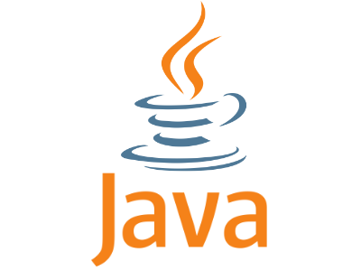

# Hi, ich bin Chris

### Über mich

- 🔴 17 Jahre alt
- 🟠 Derzeit mache ich eine Ausbildung zum Fachinformatiker Anwendungsentwicklung
- 🟡 Ich bin bei der Freiwilligen Feuerwehr

<code>
 
</code>

 
 

<table>
    <tr>
        <td>
            
        </td>
        <td>
            
        </td>
    </tr>
</table>
